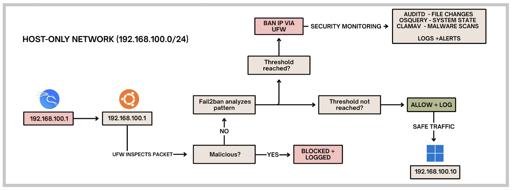

# Endpoint Defense Lab
*A multi-layered endpoint security lab open-source tools in an isolated host-only network. Simulate real-world attacks against a Windows victim with all traffic inspected, logged, and automatically blocked by an Ubuntu middle server before reaching any target*


## Traffic Flow Summary



## Architecture Concepts

***Network Isolation***  
Three virtual machines run on a private host-only network complete isolation from external networks while allowing realistic attack simulations.

All traffic between Kali and Windows must pass through Ubuntu, where every packet is inspected, logged, and either blocked or forwarded based on security rules. The Ubuntu server acts as a mandatory gateway, making Windows completely invisible to direct attacks.

***Defense Stack***
- **UFW Firewall:** Network perimeter defense - Blocks unauthorized ports and logs all connection attempts
- **Fail2ban IPS:** Intrusion prevention - Monitors logs and automatically bans attacking IPs
- **Auditd:** File integrity monitoring - Tracks all changes to critical system files
- **Osquery:** System visibility - SQL-based threat hunting and system querying
- **ClamAV:** Malware detection - Anti-virus scanning with regular definition updates

## UFW Firewall Configuration

```bash
# Default policies
sudo ufw default deny incoming
sudo ufw default allow outgoing

# Essential services
sudo ufw allow ssh        # Remote management
sudo ufw allow from 192.168.100.2  # Allow Ubuntu self

# Firewall enable
sudo ufw --force enable

# Configuration verify
sudo ufw status verbose

# Real-time log view
sudo tail -f /var/log/ufw.log | grep "UFW BLOCK"
```

## Fail2ban Configuration

```bash
# Port-scan filter configuration //etc/fail2ban/filter.d/port-scan.conf
[Definition]
failregex = ^.*UFW BLOCK.*SRC=<HOST>.*DPT=\d+.*$
ignoreregex =

# Jail configuration
[DEFAULT]
bantime = 3600
findtime = 600
maxretry = 3
ignoreip = 127.0.0.1/8

[sshd]
enabled = true
port = ssh
logpath = /var/log/auth.log
maxretry = 3

[port-scan]
enabled = true
filter = port-scan
logpath = /var/log/ufw.log
maxretry = 10
findtime = 60
bantime = 3600

[ufw-blocks]
enabled = true
filter = ufw
logpath = /var/log/ufw.log
maxretry = 5
findtime = 600
bantime = 3600

# Fail2ban service restart
sudo systemctl restart fail2ban

# Active jails status
sudo fail2ban-client status

# Real-time ban monitoring
sudo tail -f /var/log/fail2ban.log
```

## Auditd File Integrity

```bash
# /etc directory monitoring rule
sudo auditctl -w /etc -p wa -k etc_changes

# Persistent rule location //etc/audit/rules.d/audit.rules
-w /etc -p wa -k etc_changes

# Auditd service restart
sudo systemctl restart auditd

# File change search
sudo ausearch -k etc_changes -ts recent

# Real-time change monitoring
sudo tail -f /var/log/audit/audit.log | grep "etc_changes"
```

## Osquery Configuration

```bash
# Threat hunting queries
osqueryi "SELECT * FROM processes WHERE name LIKE '%nc%' OR name LIKE '%nmap%';"
osqueryi "SELECT address, port, protocol FROM listening_ports;"
osqueryi "SELECT name, cpu_time FROM processes ORDER BY cpu_time DESC LIMIT 10;"
osqueryi "SELECT * FROM logged_in_users;"
osqueryi "SELECT * FROM failed_logins GROUP BY address;"
```

## ClamAV Anti-Virus

```bash
# Virus definition update
sudo systemctl stop clamav-freshclam
sudo freshclam
sudo systemctl start clamav-freshclam

# Directory scan
clamscan -r /home
clamscan -r --bell -i /etc

# Scheduled scan task (cron)
echo "0 2 * * * /usr/bin/clamscan -r /home --log=/var/log/clamav/daily-scan.log" | sudo crontab -
```


## Log File Locations

| Service | Log Location | Purpose |
|---------|--------------|---------|
| UFW Firewall | /var/log/ufw.log | All blocked connection attempts |
| Fail2ban | /var/log/fail2ban.log | IP bans and jail activity |
| Auditd | /var/log/audit/audit.log | File integrity changes |
| Auth Logs | /var/log/auth.log | SSH and authentication attempts |
| Syslog | /var/log/syslog | General system events |
